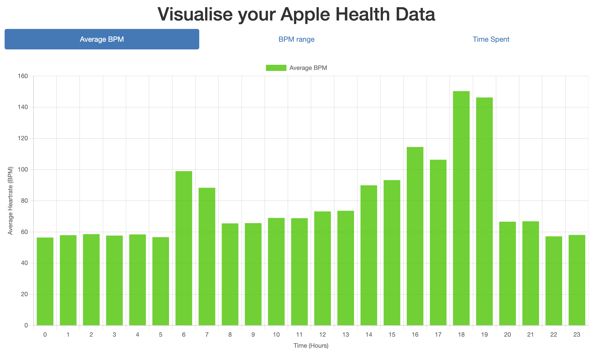
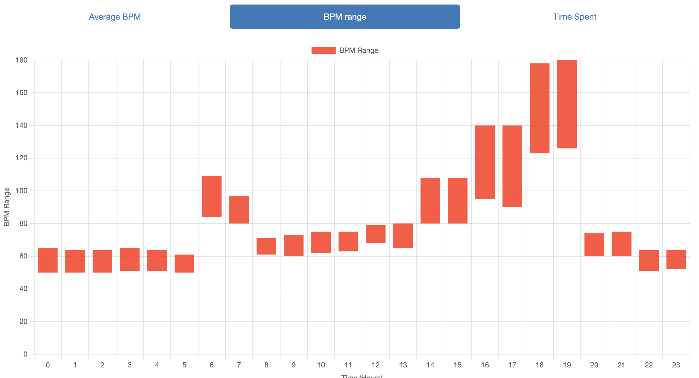
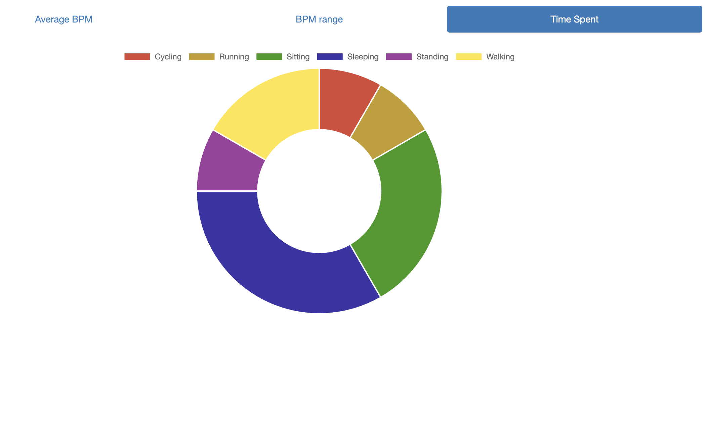

# Health Data Visualization API

A Flask-based REST API that processes and visualizes heart rate data from Apple Health, providing endpoints for analyzing BPM (Beats Per Minute) patterns and activity distributions throughout one day.

## How does it work?

1. The script, using iOS/iPadOS Shortcuts, gathers the data from Apple Health, converts it into a CSV file, and calls the `/upload` endpoint to send it to our Flask app.

2. The Flask app processes the data to be served to the frontend through the endpoints:
    - `/averageBPM`: Calculates the average BPM for each hour of the day.
    - `/rangeBPM`: Takes the Max and Min BPM values for each hour of the day.
    - `/timeActivity`: Sums the time spent on each activity.

3. When the user accesses the `/visualise` endpoint, Flask serves a template with charts created with Chart.js. When each chart is loaded for the first time, it fetches the data from the data endpoints in Step 2.
## Visualizations

Here are some sample visualizations generated by the API:

### Average BPM Throughout the Day


### BPM Range Throughout the Day


### Time Spent on Activities


## Features

- File upload support for CSV data files
- Heart rate analysis endpoints:
  - Average hourly BPM calculations
  - BPM range analysis
  - Activity duration tracking
- Interactive visualization using Chart.js
- Containerized deployment with Docker

## Tech Stack

- Python 3.12
- Flask
- Pandas (Data Processing)
- Chart.js (Frontend Visualization)
- Docker
- Bootstrap 3.4.1
- Gunicorn (WSGI Server)

## API Endpoints

- **POST /upload** - Upload heart rate data files
- **GET /averageBPM** - Retrieve hourly average heart rate
- **GET /rangeBPM** - Get BPM ranges per hour
- **GET /timeActivity** - Get time spent per activity

## Data Format

The application expects CSV files with the following structure:

```
Date,Time,BPM,Label
01/12/2025,00:00,58,Sleeping
```

